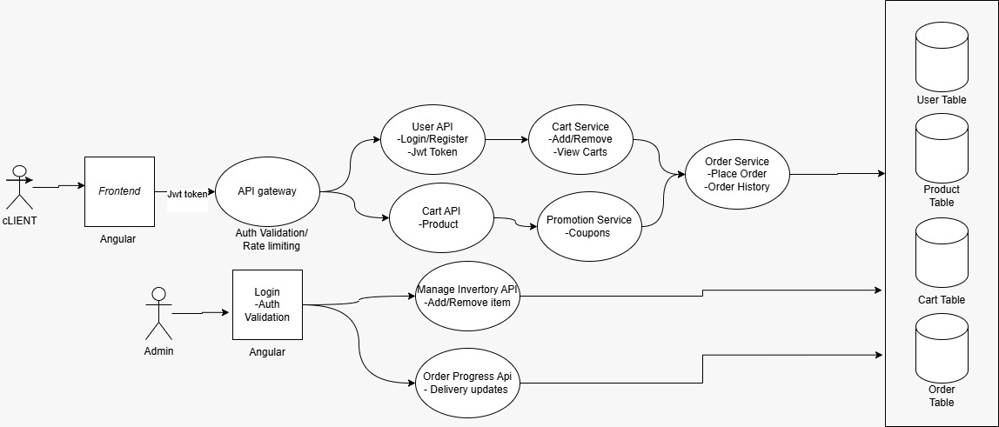

# 🛒 Retail Ordering System

A full-stack Retail Ordering System built for a hackathon that allows users to browse products, manage a cart, and place orders, while admins can manage inventory and orders.

---

## 🚀 Features

### 👤 User Features
- User Registration & Login (JWT Authentication)
- Browse Products
- Add to Cart
- Update / Remove Cart Items
- Place Order
- Order Status
- View Order History

### 👨‍💼 Admin Features
- Admin Login
- Dashboard (Orders, Revenue, Low Stock)
- Product Management (Add / Update / Delete)
- Order Management (View & Update Status)
- User Monitoring

---

## 🧭 User Flow

Login/Register  
↓  
Browse Products  
↓  
Add to Cart  
↓  
View Cart  
↓  
Enter Delivery Details  
↓  
Place Order  
↓  
Order Confirmation  

---

## 👨‍💼 Admin Flow

Admin Login  
↓  
Dashboard  
↓  
Manage Products  
↓  
View Orders  
↓  
Update Order Status  

---

### 👤 User Flow (API Summary)

POST   /api/auth/register  
POST   /api/auth/login  

GET    /api/products  

POST   /api/cart/add  
GET    /api/cart  
PUT    /api/cart/update  
DELETE /api/cart/remove/{id}  

POST   /api/orders/place  
GET    /api/orders/{id}  
GET    /api/orders/user  

---

### 👨‍💼 Admin Flow (API Summary)

POST   /api/auth/admin-login  

GET    /api/admin/dashboard  

POST   /api/products  
PUT    /api/products/{id}  
DELETE /api/products/{id}  
GET    /api/products  

GET    /api/orders  
GET    /api/orders/{id}  
PUT    /api/orders/{id}/status  

GET    /api/users  

GET    /api/admin/revenue  
GET    /api/admin/orders-count  

---

### 📊 ER Diagram

### 🔄 System Flow Diagram

  
